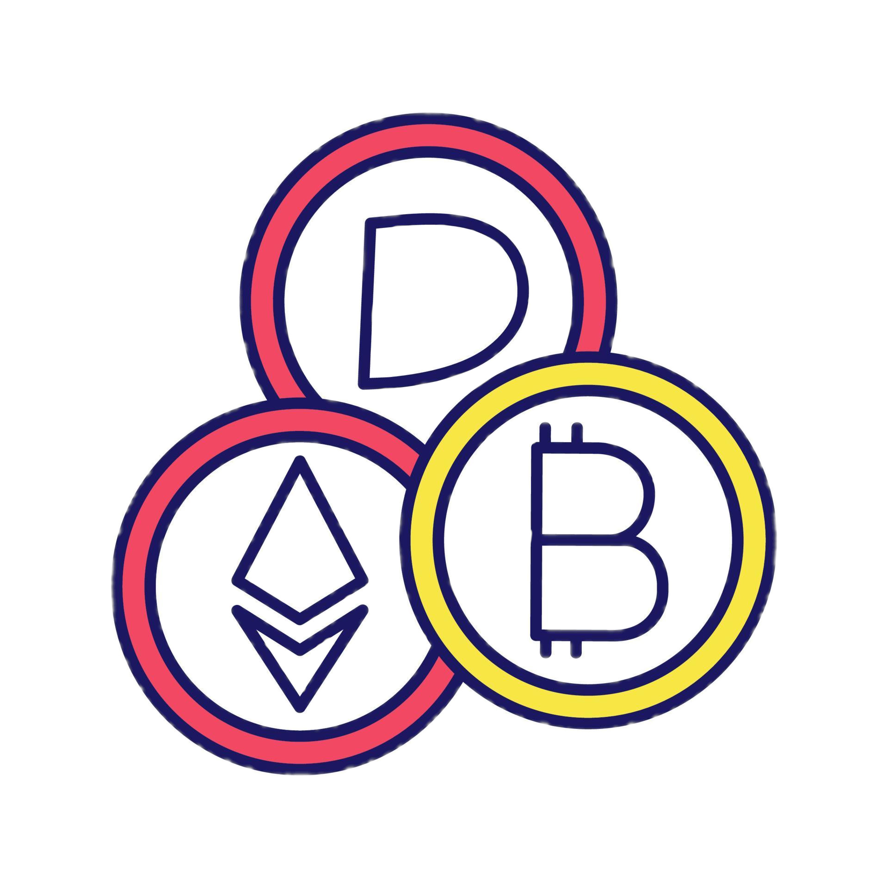
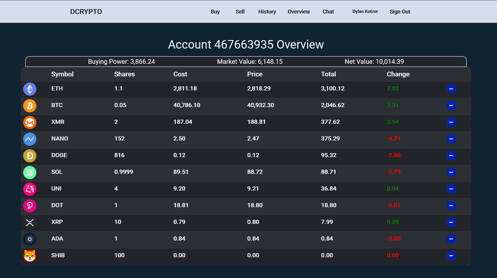
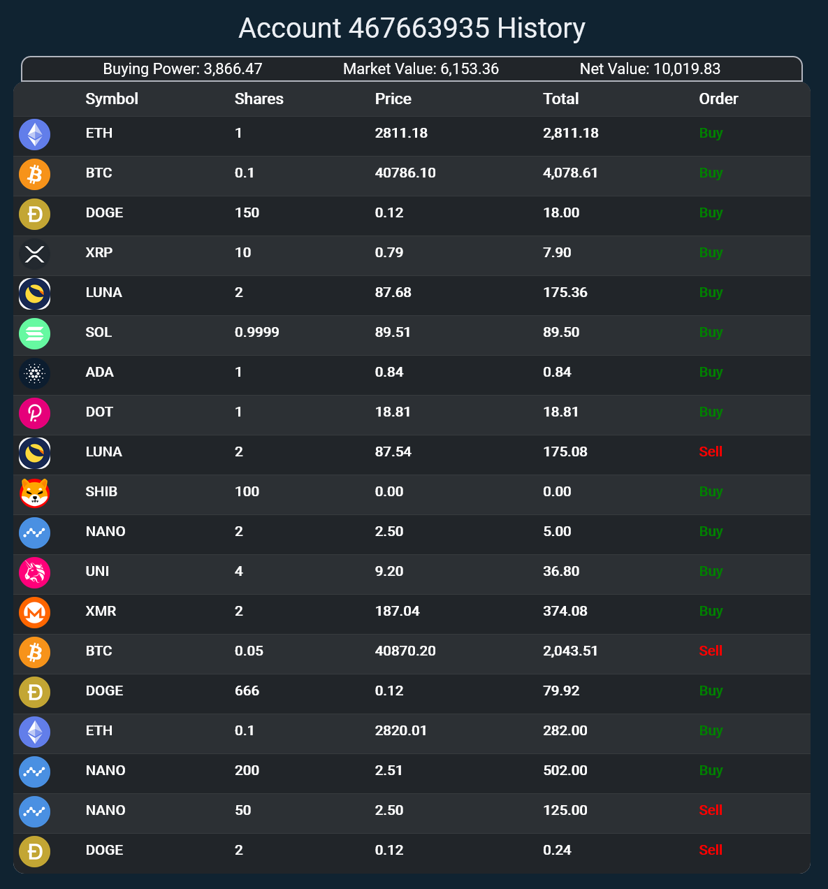

 

  

<h1 align="center">DCrypto</h3>

  

    Second Project for General Assembly SEI .

    <a href="https://github.com/DKotzer/DTrade/"><strong>Explore the docs »</strong></a>

    <!-- <a href="https://github.com/DKotzer/card-games">View Demo</a> -->
    ·
    <a href="https://github.com/DKotzer/DTrade/issues">Report Bug</a>
    ·
    <a href="https://github.com/DKotzer/DTrade/issues">Request Feature</a>

  

<!-- ABOUT THE PROJECT -->

## General Overview :bar_chart:

DCrypto is a practice trading app, or game, to practice/play at trading cryptocurrencies.
Every new account starts with 10,000 dollars USD of practice money and can buy/sell cryptocurrencies based on the current price on the Kraken trading platform.
Have you ever wanted to experience the fun of trading crypto without the risk of losing your money? Now is your chance.

You can visit the site and start trading by clicking [here].

## Account :chart_with_upwards_trend:

Before using the site you must first make an account and then log in. You can navigate using the main Navigation Bar at the top and can also log out from there.

## Summary Page :dollar:

The home page when logged in will be your account Summary.

## Buy Page :credit_card:

On the buy page you can enter the symbol of the cryptocurerncy you want to buy and request a quote. After you receive a quote you can choose to buy or call for a new quote.

## Sell Page :money_with_wings:

On the sell page you can select the symbol of the cryptocurerncy you want to sell from the drop down and request a quote. After you receive a quote you can choose to sell or call for a new quote.

## History Page :chart_with_downwards_trend:

On the history page you can view a log of all your previous transactions.

## Chat Page :speech_balloon:

On the chat page you can anonymously chat with your fellow DCrypto users, no chat logs are kept.

## Getting Started

### [Click here to check out DCrypto](https://dcrypto-app.herokuapp.com/auth/signin)

## About The Project

For my second project at my software engineering bootcamp I am making a practice trade site for trading cryptocurrencies.
The purpose of the project is to demonstrate our newly learned skills from unit 2: Node, Express, Mongoose, APIs and CRUD in comination with skills learned in unit 1: CSS, HTML, JavaScript.

## Built With:

- JavaScript
- HTML
- CSS

## Icebox :icecream:

See the [open issues](https://github.com/DKotzer/DTrade/issues) for a full list of proposed features (and known issues).

## Original Plan

Original wireframe images, I did replicate the wire frame at first but it looked very amateurish so I completely changed it to focus around the charts and a darker theme.

## Contact

Dylan Kotzer - [@DylanKotzer](https://twitter.com/DylanKotzer) - dylanKotzer@gmail.com

Project Link: [https://github.com/DKotzer/card-games](https://github.com/DKotzer/card-games)

<!-- MARKDOWN LINKS & IMAGES -->

[linkedin-url]: https://www.linkedin.com/in/dylan-kotzer-3a5421190/
[product-screenshot]: images/screenshot.png
[here]: https://dcrypto-app.herokuapp.com/
